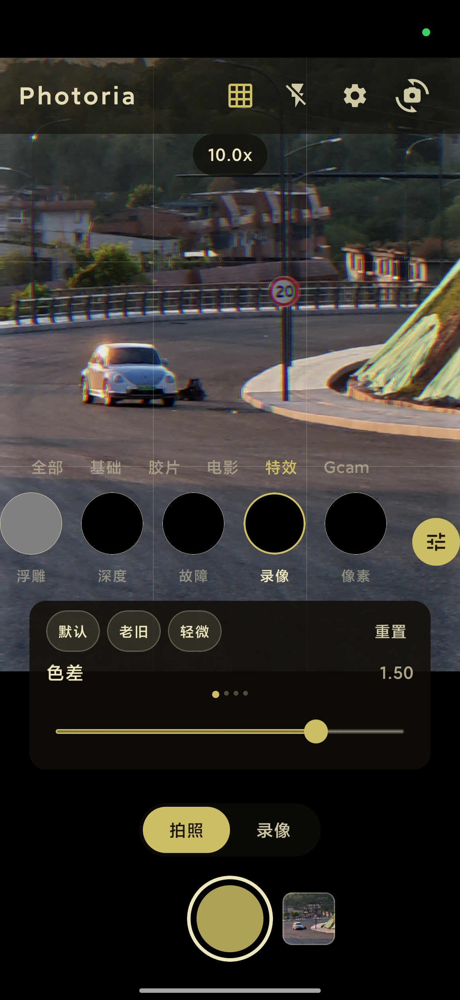
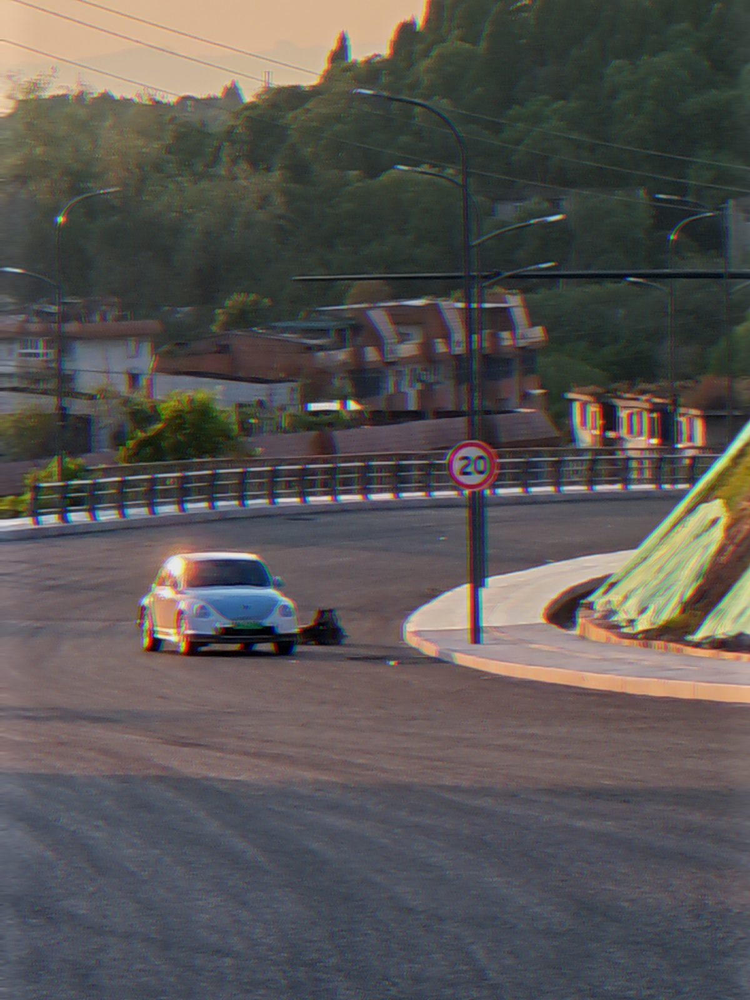

# Photoria · 后室相机

> [English](README.md) | 简体中文

Android 原生相机 App，基于 OpenGL ES 3.0 实时渲染管线 + CameraX + Jetpack Compose，将照片与视频转化为多种艺术风格，并集成多帧前处理（HDR+ / 夜景 / 智能场景识别）与复古 VHS 取景器叠加。

<p align="center">
  
  
</p>

> 左：拍照界面 · 右：滤镜样张

---

## 特性

- **23 款实时滤镜**：后室 / 胶片 / 蒙太奇 / 浮雕 / 深度 / LUT / 像素 / 青橙 / 霓虹 / 人像 / 清新 / 漂白 / 故障 / 风光 / 黑白 / 变形 / VHS / HDR+ / 夜景 / 徕卡鲜艳 / 黄蓝等，每个滤镜支持多组可调参数与 3 个预设（默认 / 强效 / 克制）。
- **多帧前处理管线**（接入 UI 真正生效到成片）：
  - **HDR+**：Camera2 Burst 包围曝光（-2 / 0 / +2 EV）+ 高斯金字塔块匹配对齐 + SAD 残差 + 双边加权 + 曝光亮度融合。
  - **夜景模式**：多帧对齐 + 时域降噪（≈ √N 降噪量级），与 HDR+ 互斥。
  - **智能场景识别**：取景待机帧降采样亮度统计，暗光自动建议开启夜景。
- **专业采集控制**（Camera2 Interop）：ISO / 快门 / 曝光补偿 / 白平衡（暖冷 + 强度）/ 手动曝光；前后摄重绑后自动恢复。
- **取景辅助**（只叠加在取景器上，**绝不进照片/录像**，导出前自动摘除）：实时 RGB 直方图 / 过曝斑马纹 / 峰值对焦（灵敏度可调）/ 气泡水平仪（加速度计）/ 三分线网格。
- **快门小工具**：音量键快门（单击/长按档位）/ 倒计时自拍（3s/10s）/ 声控快门（底噪自适应双门限）/ 连拍 2–9 帧串行拍摄 + 九宫格拼图 + GIF 动图导出，全部偏好冷启动回读。
- **滤镜强度滑杆**：0（原图）→ 1（全效果）连续混合，预览/拍照/录像共用。
- **实时调色**（Lightroom 式，作用于滤镜之后、预览/拍照/录像同一条链）：曝光、对比度、高光/阴影、白色/黑色、色温/色调、自然饱和/饱和度，外加 6 色相带 HSL（红黄绿青蓝洋红的色相/饱和/明度）+ 3 套一键预设。未改动时零成本（identity 直接跳过调色 pass），参数跨重启保持。
- **复古 VHS 取景器叠加**：老式录像机边框 + REC 红点 + 时间码 + 日期 + 电池图标，**信息录进视频文件**（GL 管线合成，所见即所得）。
- **录像**：单 pass EGL 共享纹理直渲 MediaCodec H.264 + AAC 音频，最长 3 分钟，MediaStore 保存到 `DCIM/Photoria`。
- **后室主题 UI**：荧光黄 / 奶油黄 / 暗黄棕配色，深色基调保证取景器可视性。
- **APK 瘦身**：R8 + 资源裁剪 + ABI 过滤（arm64-v8a + armeabi-v7a），Release ≈ 4 MB。

## 技术栈

| 维度 | 选型 |
|------|------|
| 语言 | Kotlin 1.9.22 |
| UI | Jetpack Compose（BOM 2024.02.00）+ Material 3 |
| 相机 | CameraX 1.4.2（含 Camera2 Interop）|
| 渲染 | OpenGL ES 3.0（GLSurfaceView + EGL 共享 Context + FBO 滤镜链）|
| 编码 | MediaCodec H.264 + AAC + MediaMuxer |
| 构建 | AGP 8.2.0 / Gradle 8.5 / JDK 17 |
| 平台 | minSdk 24 / targetSdk 34 / compileSdk 34 |

## 构建指南

### 环境要求

- JDK 17
- Android SDK（compileSdk 34）
- Android Studio Hedgehog (2023.1) 或更高版本

### 步骤

```bash
# 1. 克隆仓库
git clone https://github.com/<your-username>/backrooms-camera.git
cd backrooms-camera

# 2. 配置 SDK 路径（不会入库）
# Windows
echo "sdk.dir=D\:\\AndroidSdk" > local.properties
# macOS / Linux
echo "sdk.dir=/Users/yourname/Library/Android/sdk" > local.properties

# 3. Debug 构建
./gradlew assembleDebug
# 产物：app/build/outputs/apk/debug/app-debug.apk

# 4. 安装到设备
adb install -r app/build/outputs/apk/debug/app-debug.apk
```

### Release 签名

仓库**不包含**任何签名密钥。如需自行构建 Release 版本：

1. 生成自己的密钥库：
   ```bash
   keytool -genkeypair -v -keystore my-release.keystore -alias my-key -keyalg RSA -keysize 2048 -validity 10000
   ```
2. 在项目根目录创建 `keystore.properties`（已被 `.gitignore` 忽略）：
   ```properties
   storeFile=my-release.keystore
   storePassword=你的口令
   keyAlias=my-key
   keyPassword=你的口令
   ```
3. `./gradlew assembleRelease` 即可生成签名 APK。

### 国内网络（可选）

`settings.gradle.kts` 已配置阿里云 Maven 镜像加速依赖下载。海外开发者可按需移除镜像行，回退到官方 `google()` / `mavenCentral()`。

## 项目结构

```
app/src/main/
├── java/com/photoria/backrooms/
│   ├── PhotoriaApp.kt                # Application
│   ├── MainActivity.kt              # 入口 Activity
│   ├── camera/                       # CameraX 管理 + 多帧前处理 + 取景小传感器
│   │   ├── CameraManager.kt
│   │   ├── PreProcessor.kt          # YUV 队列 + 亮度统计
│   │   ├── VideoRecorder.kt
│   │   ├── LevelSensor.kt           # 气泡水平仪（加速度计姿态）
│   │   ├── VoiceShutter.kt          # 声控快门（麦克风监听）
│   │   └── VoiceTriggerLogic.kt     # 触发判定纯逻辑（可单测）
│   ├── capture/                      # 连拍编排（串行快门 + 九宫格拼图）
│   ├── gif/                          # GIF89a 编码器（纯 Kotlin，无依赖）
│   ├── gl/                           # OpenGL 渲染层
│   │   ├── GLRenderer.kt             # 核心渲染器
│   │   ├── CameraGLSurfaceView.kt
│   │   ├── FilterChain.kt
│   │   ├── HistogramProbe.kt         # GPU 降采样 + CPU 直方图分箱
│   │   ├── ProOverlayPass.kt         # 取景辅助叠加（斑马纹/峰值，不进成片）
│   │   └── filter/                   # 23 款滤镜实现
│   ├── encoder/                      # MediaCodec H.264/AAC + EGL 共享
│   ├── ui/                           # Compose UI
│   │   ├── screen/CameraScreen.kt
│   │   ├── components/
│   │   ├── theme/Theme.kt
│   │   └── viewmodel/CameraViewModel.kt
│   └── util/                         # Shader / Texture / 持久化 / 图片保存 / EXIF 方向
└── assets/shaders/                   # GLSL（含 #include 预处理）
    ├── vertex/
    └── fragment/                     # 31 个 shader（含多帧对齐 / 融合 / 下采样 / 取景叠加）
```

## 渲染管线

```
CameraX Preview
  → SurfaceTexture (GL_TEXTURE_EXTERNAL_OES)
    → OES→2D shader → FBO
      → FilterChain.apply() → 滤镜纹理
        → 屏幕渲染（letterbox 顶对齐）
        → 录制：滤镜纹理 blit 到编码器 Surface（单 pass）
```

多帧 HDR+ 路径在快门按下时额外走：

```
Camera2 Burst([-2,0,+2] EV) → 3 帧 YUV → GL_RED 纹理
  → 高斯金字塔 → align_blockmatch.glsl 块匹配 → warp.glsl 变形
  → hdr_merge.glsl（SAD + 双边 + 曝光加权）→ FilterChain → 保存
```

## 已知问题

- **录像停止瞬间闪退**：怀疑 native 崩溃（GL / MediaCodec / EGL 驱动层），Java try-catch 抓不到。早期 4 次尝试（EOS 排空 / EglCore.release 不 terminate / unbindCurrent 顺序 / stopRecording 两阶段）未解决；近期又完成一轮系统性修复（EGL 收尾保住 GL 线程 current context / 音频线程 EOS 卡死与跨线程 release 竞争 / 录像帧绘制与释放串行化），**尚待真机验证**。若仍复现请附 `adb logcat` native 栈，欢迎社区贡献定位思路。
- **取景器叠加杂纹**：开启复古取景器后偶发画面杂乱纹路，怀疑合成 FBO 每帧未 `glClear` 或 blend 状态污染。

## 贡献

欢迎 Issue 与 PR。提 PR 前请：

1. 跑通 `./gradlew assembleDebug` 与 `./gradlew check`（`check` 已挂 `runSmokeMain`：纯 Kotlin 无设备自证，覆盖 GIF 编码 / 连拍拼图 / EXIF 方向等 100+ 断言，无需真机）。
2. 保持 Kotlin 代码风格（`kotlin.code.style=official`）。
3. 涉及 GL 修改请遵守 Shader 约定：单 shader 纹理采样 ≤9 次；新增 shader 用 `#include "shaders/fragment/common.glsl"` 复用 `hash21` / `valueNoise` / `luma`。

## 协议

[Apache License 2.0](LICENSE)

Copyright 2026 Photoria Contributors
